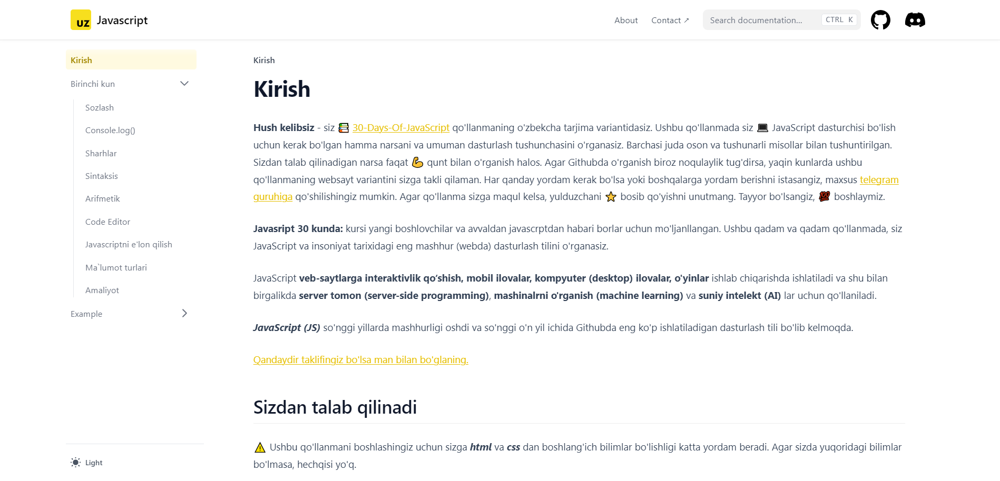

# Javascript in 30 days challenge

This challenge created by [Mukhammadjohn Anvarov](https://anvarov.vercel.app/).

[**Live Demo →**](https://javascript-uz-ten.vercel.app/)

## Quick Start
## Local Development

First, run `pnpm i` to install the dependencies.

Then, run `pnpm dev` to start the development server and visit localhost:3000.

## License

This project is licensed under the MIT License.
